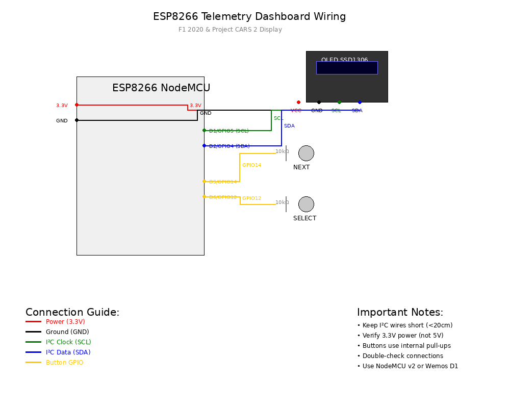

# ESP8266 Telemetry Dashboard for F1 2020 & Project CARS 2

A complete, production-ready ESP8266 project that receives UDP telemetry from F1 2020 and Project CARS 2, displaying real-time racing data on a compact 0.91" OLED display.

## Features

- **Dual Game Support**: F1 2020 (full UDP spec) and Project CARS 2 (with PC forwarder)
- **Multi-Page Dashboard**: Speed/Gear, Lap/Fuel, Debug, and Settings pages
- **Real-time Display**: 128x32 OLED with RPM bar and large speed/gear display
- **Robust Networking**: Auto-reconnect WiFi, UDP timeout handling
- **Button Navigation**: Two-button interface for page switching and settings
- **Modular Code**: Clean C++ architecture with separate modules

## Hardware Requirements

### ESP8266 Development Board
- NodeMCU v2 (ESP8266-12E) recommended
- Wemos D1 Mini also compatible
- USB cable for programming

### Display
- 0.91" SSD1306 OLED Display (128x32 pixels)
- I2C interface

### Buttons (Optional)
- 2x Momentary push buttons
- 2x 10kΩ pull-up resistors (if not using internal pull-ups)

### Wiring Diagram

```
NodeMCU Pin  GPIO    Component
-----------  ----    ---------
D2           4   --> SDA (OLED)
D1           5   --> SCL (OLED)
3V3              --> VCC (OLED)
GND              --> GND (OLED)

D5           14  --> Next Button (other side to GND)
D6           12  --> Select Button (other side to GND)
```



## Software Setup

### PlatformIO (Recommended)

1. **Install PlatformIO**:
   ```bash
   # Install PlatformIO Core
   pip install platformio
   
   # Or use PlatformIO IDE extension in VS Code
   ```

2. **Build and Upload**:
   ```bash
   # Navigate to project directory
   cd /path/to/PLAN_FOR_HER
   
   # For ESP8266 (NodeMCU, Wemos D1 Mini):
   pio run -e esp8266
   pio run -t upload -e esp8266
   
   # For ESP32:
   pio run -e esp32dev
   pio run -t upload -e esp32dev
   
   # Monitor serial output
   pio device monitor
   
   # Quick build script for ESP8266:
   ./build_and_upload.sh
   ```

### Arduino IDE (Alternative)

1. **Install ESP8266 Board Package**:
   - File → Preferences → Additional Board Manager URLs
   - Add: `http://arduino.esp8266.com/stable/package_esp8266com_index.json`
   - Tools → Board → Boards Manager → Search "ESP8266" → Install

2. **Install Libraries**:
   - Adafruit SSD1306
   - Adafruit GFX Library
   - Adafruit BusIO
   - ArduinoJson

3. **Configure Board**:
   - Tools → Board → NodeMCU 1.0 (ESP-12E Module)
   - Tools → Port → Select your ESP8266 port

4. **Upload**:
   - Open `src/main.cpp` in Arduino IDE
   - Click Upload

## Network Configuration

### WiFi Setup

Edit `include/config.h` to match your network:

```cpp
#define WIFI_SSID "your_network_name"
#define WIFI_PASSWORD "your_password"
```

**Default Configuration**: Hotspot "fox" with password "12345678"

### Hotspot Recommendations

For best results, use a mobile hotspot:
- **Android**: Settings → Network & Internet → Hotspot & Tethering
- **iPhone**: Settings → Personal Hotspot

**Important**: Ensure UDP broadcast is enabled on your hotspot.

## Game Configuration

### F1 2020 Setup

1. **Enable UDP Telemetry**:
   - Game Settings → Telemetry Settings
   - UDP Telemetry: ON
   - UDP IP Address: ESP8266 IP (e.g., 192.168.43.100)
   - UDP Port: 20777
   - UDP Send Rate: 20Hz
   - UDP Format: 2020

2. **Packet Types**: Enable "Car Telemetry" at minimum

### Project CARS 2 Setup

PCARS2 requires a PC forwarder due to complex UDP format:

#### Option 1: Python Forwarder (Recommended)

1. **Enable UDP in PCARS2**:
   - Options → System → UDP Frequency: 10
   - UDP Protocol Version: 2
   - UDP Port: 5606

2. **Run Forwarder**:
   ```bash
   # Real PCARS2 data
   python test/pcars_forwarder.py [ESP8266_IP]
   
   # Simulated data for testing
   python test/pcars_forwarder.py [ESP8266_IP] --simulate
   ```

#### Option 2: SimHub/RS Transmitter

For advanced users, configure SimHub or RS Transmitter to forward JSON data to ESP8266 port 20778.

## Testing

### F1 2020 Simulator

Test F1 telemetry without the game:

```bash
# Send simulated F1 packets to ESP8266
python test/sim_send_f1.py [ESP8266_IP]

# Example with specific IP
python test/sim_send_f1.py 192.168.43.100
```

The simulator generates realistic driving data with varying speed, gear, and RPM.

### PCARS2 Simulator

Test PCARS2 telemetry:

```bash
# Simulate PCARS2 data
python test/pcars_forwarder.py [ESP8266_IP] --simulate
```

## Dashboard Pages

Navigate with the **Next** button, modify settings with **Select**:

### Page 1: Speed & Gear
- Large speed display (left)
- Large gear display (right)
- RPM bar (bottom)

### Page 2: Lap & Fuel
- Lap time
- Fuel percentage
- Position (if available)
- Small speed/RPM (right side)

### Page 3: Debug
- Last packet type
- Packet size
- Source IP address
- Data age

### Page 4: Settings
- Game selection (F1/PCARS)
- Use **Select** button to switch games

## Troubleshooting

### Common Issues

1. **"WiFi Failed!" on Display**:
   - Check SSID/password in `config.h`
   - Ensure hotspot is active
   - Try moving closer to router/hotspot

2. **"NO DATA" on Display**:
   - Verify game UDP settings
   - Check ESP32 IP address
   - Ensure firewall allows UDP traffic
   - Test with simulator scripts

3. **Compilation Errors**:
   - Update PlatformIO libraries: `pio lib update`
   - Check all files are in correct directories
   - Verify ESP32 board package is installed

4. **Display Not Working**:
   - Check I2C wiring (SDA/SCL)
   - Verify display address (0x3C default)
   - Test with I2C scanner

### Network Debugging

1. **Find ESP32 IP**:
   - Check serial monitor during startup
   - Use router admin panel
   - Try network scanner app

2. **Test UDP Connectivity**:
   ```bash
   # Send test packet (Linux/Mac)
   echo "test" | nc -u [ESP32_IP] 20777
   ```

3. **Firewall Issues**:
   - Windows: Allow Python through Windows Firewall
   - Disable firewall temporarily for testing
   - Check router UDP forwarding settings

### F1 2020 Specific

- **No Telemetry**: Ensure you're in a session (Practice/Qualifying/Race)
- **Wrong Data**: Check UDP format is set to "2020"
- **Intermittent Data**: Increase UDP send rate to 20Hz

### PCARS2 Specific

- **Binary UDP Issues**: Use JSON forwarder instead
- **Forwarder Errors**: Check PCARS2 UDP is enabled
- **No Broadcast**: Some networks block UDP broadcast

## Development

### Project Structure

```
├── include/
│   └── config.h              # Configuration constants
├── src/
│   ├── main.cpp              # Main application
│   ├── network_manager.h/.cpp # WiFi and UDP handling
│   ├── telemetry_f1.h/.cpp   # F1 2020 packet parser
│   ├── telemetry_pcars.h/.cpp # PCARS2 packet parser
│   ├── display_manager.h/.cpp # OLED display control
│   └── buttons.h/.cpp        # Button input handling
├── test/
│   ├── sim_send_f1.py        # F1 simulator
│   └── pcars_forwarder.py    # PCARS2 forwarder
└── platformio.ini            # Build configuration
```

### Adding New Features

1. **New Telemetry Fields**:
   - Modify telemetry parser structs
   - Update display pages
   - Add to simulator scripts

2. **Additional Games**:
   - Create new parser in `src/telemetry_[game].h/.cpp`
   - Add game type to `config.h`
   - Update main loop and settings page

3. **Display Enhancements**:
   - Modify `display_manager.cpp`
   - Add new page types
   - Update button handling

### F1 2020 UDP Specification

This implementation follows the official F1 2020 UDP specification:
- **Reference**: https://f1-2020-telemetry.readthedocs.io
- **Packet Format**: 2020
- **Endianness**: Little-endian
- **Header Size**: 24 bytes
- **Car Telemetry**: Packet ID 6

### PCARS2 UDP Notes

PCARS2 UDP format is complex and varies by version. This implementation:
- Provides basic binary parsing (limited)
- Recommends JSON forwarder for reliability
- Includes community documentation links

## Performance

- **Update Rate**: 10-20 Hz display refresh
- **Memory Usage**: ~50KB RAM
- **Power Consumption**: ~200mA @ 3.3V
- **WiFi Range**: Typical ESP32 range (30-50m)

## License

MIT License - see LICENSE file for details.

## Contributing

1. Fork the repository
2. Create feature branch
3. Test with both simulators
4. Submit pull request

## Support

- **Issues**: Use GitHub Issues for bug reports
- **Discussions**: Use GitHub Discussions for questions
- **Documentation**: Check this README and code comments

## Acknowledgments

- F1 2020 UDP specification by Codemasters
- PCARS2 community reverse engineering efforts
- Adafruit libraries for display support
- ESP32 Arduino framework